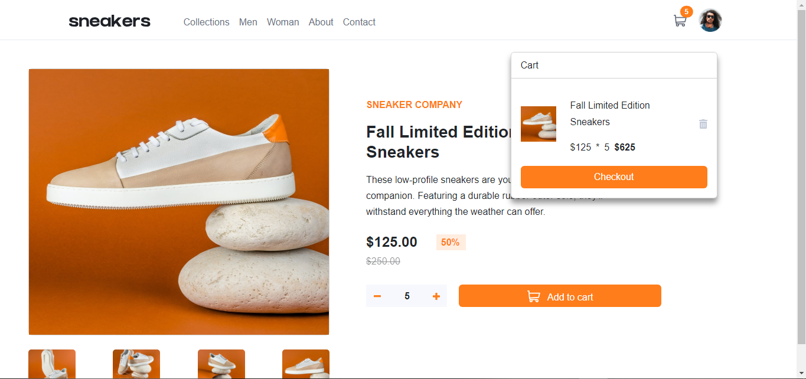

## Table of contents

- [Overview](#overview)
  - [Screenshot](#screenshot)
  - [Links](#links)
- [My process](#my-process)
  - [Built with](#built-with)
  - [What I learned](#what-i-learned)
- [Author](#author)

## Overview

### Screenshot

*** Desktop view ***

*** Mobile view ***

### Links

- Solution URL: [Click to view project](https://github.com/G-best007/E-commerce-Product-Page)
- Live Site URL: [Click to view project live](https://g-best007.github.io/E-commerce-Product-Page/)

## My process

### Built with

- Semantic HTML5 markup
- CSS custom properties
- Flexbox
- Bootstrap 5

### What I learned

- How to add items to cart
- Multiply the price with the numbers of items in the cart
- Hover on the Thumbnail to show the product images
- Also adding a live toast after clicking on the product image in the desktop mode

## Author

- Frontend Mentor - [@G-best007](https://www.frontendmentor.io/profile/G-best007)
- Twitter - [@G-best007](https://www.twitter.com/g_best007)

